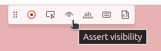
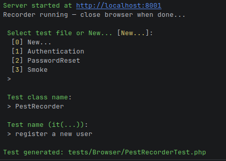

# Laravel Pest Browsertest Recorder

This package introduces the `php artisan pest:record` command which provides an interactive way to generate a base for your Pest Browsertests.

Running this command allows you to perform actions in the browser which will be translated into Pest tests.
This process works by using the `npx playwirght codegen` command. You can use the Codegen toolbar to add assertions:



By default, a development server (`php artisan serve`) will be started, this can be disabled with the `--server=false` flag.

After closing the browser you'll be prompted with a question if you want to expand an existing test file or create a new one, and to give your new test a name:



## Installation

You can install the package via composer:

```bash
composer require tranquil-tools/laravel-pest-recorder --dev
```

You can publish the config file with:

```bash
php artisan vendor:publish --tag="laravel-pest-recorder-config"
```

The content of the published config can be viewed [here](./config/pest-recorder.php).

## Usage

```cli
php artisan pest:record
```
or:
```cli
php artisan pest:record
    --env=testing
    --url=http://localhost:8001
    --visit=/login
    --server=true
    --migrate-fresh=false
    --seed=false
    --viewport-size=1920,1080
```

## Available flags / options
The environment variable, obliged when using --migrate-fresh=true
```cli
--env=testing
```
Provide a URL which will be opened in the browser as starting point for your tests.
When omitted, your .env APP_URL setting will be used.
```cli
--url=http://localhost:8001
```
Open a specific URI path when the recording browser starts. The path is appended to the base URL.
The initial navigation will automatically generate `$page = visit('/...');` in the test.
```cli
--visit=/login
```
Starts a development server (php artisan serve) for the given environment, URL and port.
```cli
--server=true
```
Run `php artisan migrate:fresh` before starting the server? Specifying --env=... is mandatory.
```cli
--migrate-fresh=false
```
Do you want to seed the database after migrate:fresh? This option is only available when using `--migrate-fresh=true`.
```cli
--seed=false
```
Specify viewport dimensions for the browser.
```cli
--viewport-size=1920,1080
```

## Testing

```bash
composer test
```

## Changelog

Please see [CHANGELOG](CHANGELOG.md) for more information on what has changed recently.

## Contributing

Pull requests are welcome!

## Security Vulnerabilities

Please review [our security policy](../../security/policy) on how to report security vulnerabilities.

## Credits

- [ComfyCoders BV](https://github.com/comfycodersbv) - https://comfycoders.nl

## License

The MIT License (MIT). Please see [License File](LICENSE.md) for more information.
